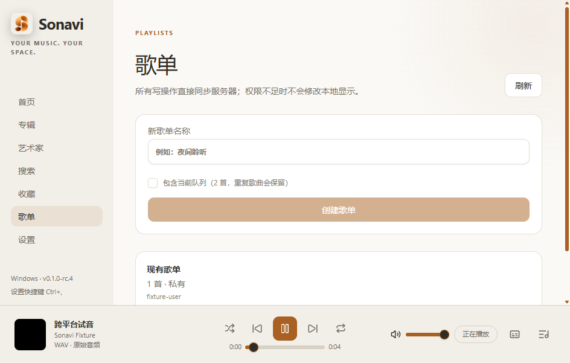
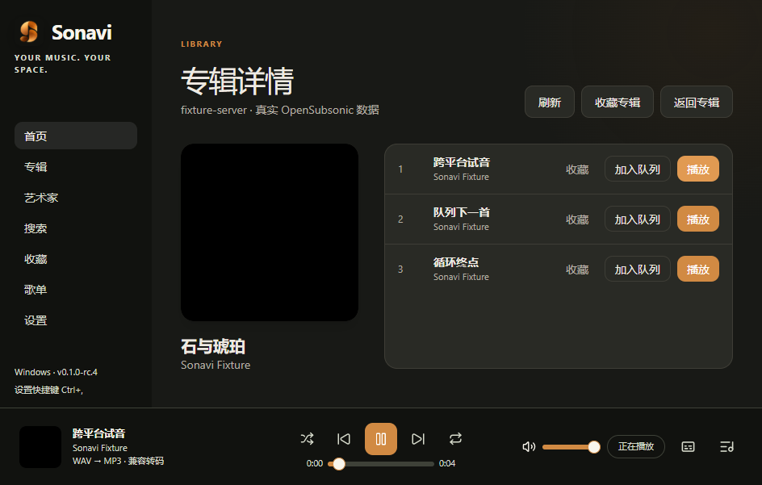

# Sonavi

Sonavi 是一款简洁、跨平台的 Navidrome、Subsonic 与 OpenSubsonic 桌面音乐客户端。

支持 Windows 11 x64、macOS 13+ Intel x64 和 macOS 13+ Apple Silicon arm64。

## 界面预览

以下截图使用本地测试数据，不包含真实账号或服务器信息。

| 浅色歌单 | 深色专辑详情 |
| --- | --- |
|  |  |

## 下载

前往 [GitHub Releases](https://github.com/zhiyxn/Sonavi/releases) 下载最新 Pre-release：

- Windows x64：`Sonavi-0.1.0-rc.5-win-x64.exe`
- macOS Intel x64：`Sonavi-0.1.0-rc.5-mac-x64.dmg`
- macOS Apple Silicon arm64：`Sonavi-0.1.0-rc.5-mac-arm64.dmg`

下载后可使用 Release 中的 `SHA256SUMS.txt` 校验文件完整性。

## 功能

- 连接 Navidrome、Subsonic 与 OpenSubsonic 服务器；
- 浏览首页、专辑和艺术家，支持分页搜索；
- 收藏歌曲、专辑和艺术家；
- 创建、编辑和播放歌单；
- 播放队列、随机与循环播放；
- 原始音频播放、MP3 兼容转码与进度跳转；
- 同步歌词、普通歌词和多歌词版本；
- Windows 托盘与 macOS 菜单栏播放控制；
- 安全重启、关闭隐藏和暂停队列恢复；
- 深色/浅色主题、音量与窗口状态保存；
- 脱敏连接诊断与账号隔离封面缓存。

## 安装提示

当前版本是未签名、未公证的测试版：

- Windows 可能显示 SmartScreen“未知发布者”提示；
- macOS 可能被 Gatekeeper 阻止首次启动。

请只从本项目 GitHub Releases 下载并核对 SHA-256。不要关闭 SmartScreen、Gatekeeper、TLS 或其他系统安全保护。确认文件可信后，macOS 用户可在“系统设置 → 隐私与安全性”中选择“仍要打开”。

## 当前状态

Windows x64 与 macOS Intel x64 已完成真实安装、播放、重启和卸载测试。Apple Silicon arm64 已通过原生 CI 构建与自动检查，但目前缺少 arm64 实机人工验收。

Sonavi 仍处于 Pre-release 阶段，不代表正式稳定版。

## 开源协议

Sonavi 使用 [MIT License](LICENSE)。

## 文档

开发、架构、安全、测试与发布说明位于 [`docs/`](docs/)。
