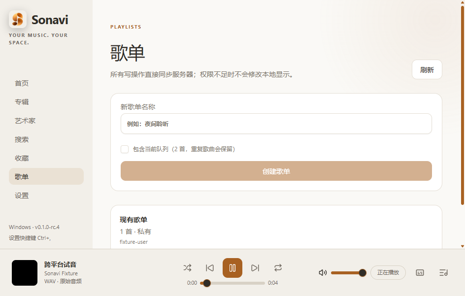
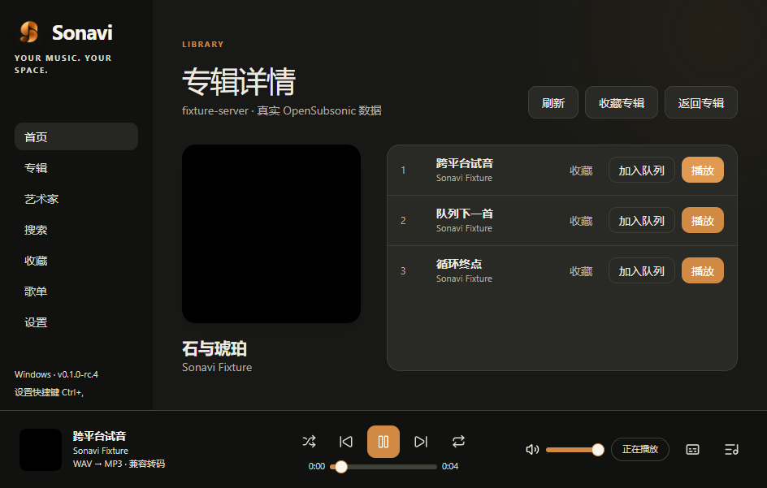

# Sonavi

Sonavi 是一款简洁、跨平台的 Navidrome、Subsonic 与 OpenSubsonic 桌面音乐客户端。

支持 Windows 11 x64、macOS 13+ Intel x64 和 macOS 13+ Apple Silicon arm64。

## English overview

Sonavi (听屿) is a minimal, cross-platform desktop music client for **Navidrome, Subsonic and OpenSubsonic** servers. One Electron + Vue 3 + TypeScript codebase targets **Windows 11 x64, macOS 13+ Intel x64 and macOS 13+ Apple Silicon arm64**. MIT licensed.

- Connect to Navidrome / Subsonic / OpenSubsonic with token+salt auth and capability probing — unsupported features degrade instead of breaking;
- Manage multiple saved server accounts, with confirmation before switching;
- Browse and search albums, artists and songs with server-side pagination; favorites for songs, albums and artists;
- Playlists (create, edit, delete, play) and a real playback queue (shuffle / repeat / reorder);
- Streaming playback with seeking (HTTP Range 200/206/416), optional MP3-compatible transcoding, synced and plain lyrics;
- Windows tray / macOS menu-bar controls, media keys, close-to-tray with an explicit real quit, restore the queue paused after restart;
- Simplified Chinese / English interface, light / dark themes and saved preferences;
- Credentials encrypted via Electron `safeStorage` (no plaintext fallback), with `contextIsolation` + `sandbox` + strict CSP;
- Update checks on startup (enabled by default, configurable) and manual checks in Settings, with a browser link to the installer for your OS and architecture. RC builds can detect newer RCs or stable releases; stable builds only detect stable releases. Download and installation are handled by the browser and the user;
- Downloads: [v0.1.0-rc.8 pre-release](https://github.com/zhiyxn/Sonavi/releases/tag/v0.1.0-rc.8), verify with the release's `SHA256SUMS.txt`. Builds have no official distribution signing; macOS builds are not notarized.

Project documentation is currently written in Chinese; an English translation is planned.

## 界面预览

以下截图使用本地测试数据，不包含真实账号或服务器信息。

| 浅色歌单 | 深色专辑详情 |
| --- | --- |
|  |  |

## 下载

前往 [v0.1.0-rc.8 Pre-release](https://github.com/zhiyxn/Sonavi/releases/tag/v0.1.0-rc.8) 下载测试版：

- Windows x64：`Sonavi-0.1.0-rc.8-win-x64.exe`
- macOS Intel x64：`Sonavi-0.1.0-rc.8-mac-x64.dmg`
- macOS Apple Silicon arm64：`Sonavi-0.1.0-rc.8-mac-arm64.dmg`

下载后可使用 Release 中的 `SHA256SUMS.txt` 校验文件完整性。

版本变更见 [rc.8 发布说明](docs/RELEASE-NOTES-v0.1.0-rc.8.md)，历史版本可从 [所有 Releases](https://github.com/zhiyxn/Sonavi/releases) 获取。

## 功能

- 连接 Navidrome、Subsonic 与 OpenSubsonic 服务器；
- 多服务器账号管理，支持保存、切换和删除，切换前二次确认；
- 浏览音乐、专辑和艺术家，支持页内搜索与服务端分页；
- 收藏歌曲、专辑和艺术家；
- 创建、编辑和播放歌单；
- 播放队列、随机与循环播放；
- 原始音频播放、MP3 兼容转码与进度跳转；
- 同步歌词、普通歌词和多歌词版本；
- Windows 托盘与 macOS 菜单栏播放控制；
- 安全重启、关闭隐藏和暂停队列恢复；
- 简体中文/英文界面，深色/浅色主题、音量与窗口状态保存；
- 启动自动检查与手动检查更新，浏览器下载对应平台安装包；
- 脱敏连接诊断与账号隔离封面缓存。

## rc.8 的主要变化

- 设置页显示当前版本，支持手动检查更新；启动时自动检查默认开启，可在设置中关闭并保存偏好。
- RC 版本可发现更高的 RC 或正式版，正式版只提示更高的正式版；版本检测不要求当前包已签名。
- 启动检查结果保留在设置页，打开设置即可查看已发现的新版本，无需再次检查。
- 新版本提供当前系统与架构的安装包时，可点击“下载当前系统安装包”，由默认浏览器下载；附件缺失时可打开发布页。安装由用户手动完成。
- 设置页七个分组统一使用边框内标题，中文与英文文案同步。

检查更新不会自动下载、安装或重启应用，网络失败不影响连接和播放。下载后请按对应 Release 的 `SHA256SUMS.txt` 校验文件，再退出 Sonavi 并安装新版本。

## 安装提示

当前版本是未签名、未公证的测试版：

- Windows 可能显示 SmartScreen“未知发布者”提示；
- macOS 可能被 Gatekeeper 阻止首次启动。

请只从本项目 GitHub Releases 下载并核对 SHA-256。不要关闭 SmartScreen、Gatekeeper、TLS 或其他系统安全保护。确认文件可信后，macOS 用户可在“系统设置 → 隐私与安全性”中选择“仍要打开”。

## 当前状态

此前候选版的 Windows x64 与 macOS Intel x64 已完成真实安装、播放、重启和卸载测试。Apple Silicon arm64 已通过原生 CI 构建与自动检查，但目前缺少 arm64 实机人工验收。

rc.8 的更新检查与设置页改动已通过 macOS Intel 本地自动检查和源码 Electron 冒烟；真实新版本下载、跨版本安装及升级后数据恢复尚未验证，Windows x64 与 macOS arm64 的本轮实机验证也待完成。此前版本的验收不代表新安装包已通过验收。

Sonavi 仍处于 Pre-release 阶段，不代表正式稳定版。

## 开源协议

Sonavi 使用 [MIT License](LICENSE)。

## 文档

开发、架构、安全、测试与发布说明位于 [`docs/`](docs/)，包括 [测试报告](docs/TEST-REPORT.md)、[已知问题](docs/KNOWN-ISSUES.md) 和 [发布检查清单](docs/RELEASE-CHECKLIST.md)。
